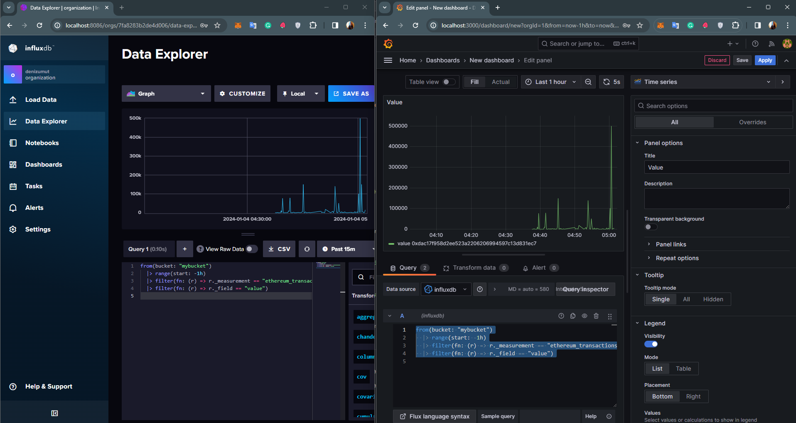
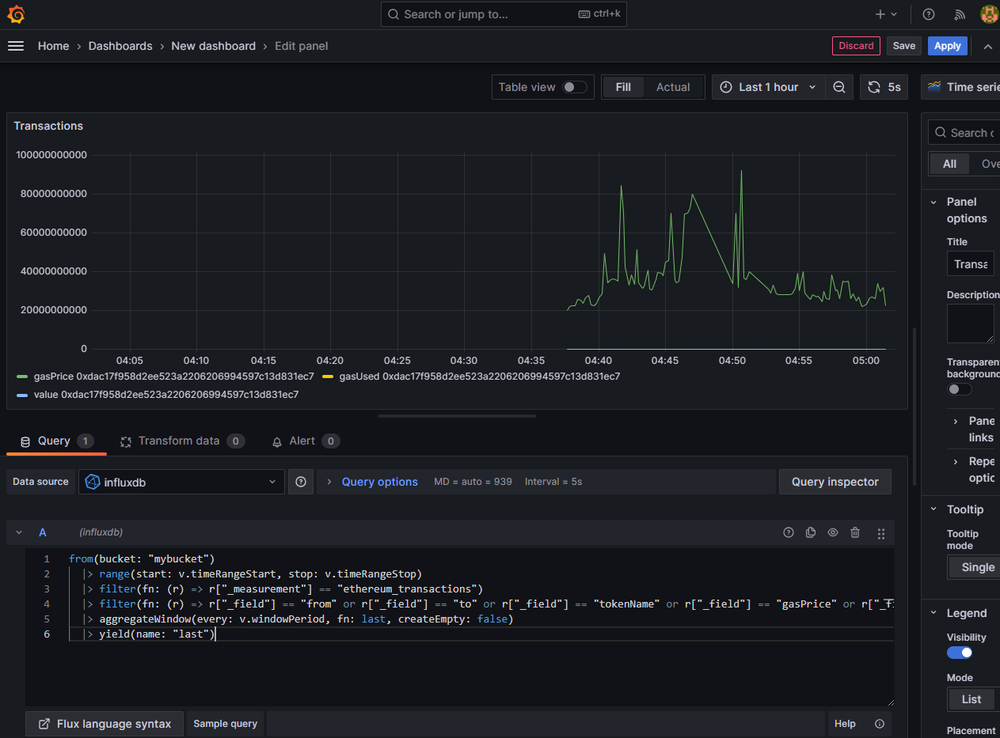

# Ethereum Smart Contract Transaction Monitor

This project demonstrates how to monitor Ethereum smart contract transactions in real-time using Etherscan, InfluxDB, and Grafana. It fetches transaction data from the Ethereum blockchain via the Etherscan API, stores it in InfluxDB, and visualizes it in Grafana.

## Table of Contents

- [Ethereum Smart Contract Transaction Monitor](#ethereum-smart-contract-transaction-monitor)
  - [Table of Contents](#table-of-contents)
  - [Introduction](#introduction)
  - [Tech Stack](#tech-stack)
  - [Setup and Configuration](#setup-and-configuration)
    - [Etherscan API](#etherscan-api)
    - [InfluxDB](#influxdb)
    - [Grafana](#grafana)
  - [Running the Monitor](#running-the-monitor)
  - [Visualization in Grafana](#visualization-in-grafana)
  - [Contributing](#contributing)
  - [License](#license)
  - [Contact](#contact)

## Introduction

This project provides a comprehensive solution for real-time monitoring of Ethereum smart contract transactions. It's designed to fetch, store, and visualize transaction data, making it invaluable for blockchain analytics, financial tracking, or anomaly detection.

## Tech Stack

- **Etherscan API**: Interfaces with the Ethereum blockchain to retrieve detailed transaction data.
- **InfluxDB**: Handles large influxes of time-series data, perfect for storing transaction details over time.
- **Grafana**: Visualizes time-series data in an interactive, user-friendly manner, allowing for deep insights into transaction trends and patterns.
- **Python**: Offers the flexibility and libraries necessary for blockchain data retrieval and processing.

## Setup and Configuration
     ```
     docker-compose up -d
     ```

### Etherscan API

1. Obtain an API key from [Etherscan](https://etherscan.io/apis).
2. Securely store the API key in a `.env` file.

### InfluxDB

1. Install InfluxDB and set up a bucket named `mybucket` (or any) for storing transaction data.
2. Configure retention policies as needed to manage data storage efficiently.

### Grafana

1. Install Grafana and integrate it with InfluxDB for real-time data visualization.
2. Set up various dashboards to track different aspects of Ethereum transactions.

## Running the Monitor

1. Execute the Python script to periodically fetch transaction data from Etherscan.
2. Data includes block number, transaction hash, nonce, addresses, value transferred, and gas details.

## Visualization in Grafana

1. **Value Transaction Query**: Visualize the value of transactions over time.

```flux
   from(bucket: "mybucket")
|> range(start: -1h)
|> filter(fn: (r) => r._measurement == "ethereum_transactions")
|> filter(fn: (r) => r._field == "value")
```




1. **Gas Consumption Table**: Monitor gas usage in transactions.

```flux
from(bucket: "mybucket")
|> range(start: v.timeRangeStart, stop: v.timeRangeStop)
|> filter(fn: (r) => r["_measurement"] == "ethereum_transactions")
|> filter(fn: (r) => r["_field"] == "from" or r["_field"] == "to" or r["_field"] == "tokenName" or r["_field"] == "gasPrice" or r["_field"] == "gasUsed" or r["_field" == "value")
|> aggregateWindow(every: v.windowPeriod, fn: last, createEmpty: false)
|> yield(name: "last")
```


## Contributing

Your contributions are welcome!

## License

This project is released under the [MIT License](https://opensource.org/licenses/MIT).

## Contact

[Deniz Umut Dereli](https://www.linkedin.com/in/denizumutdereli/)
